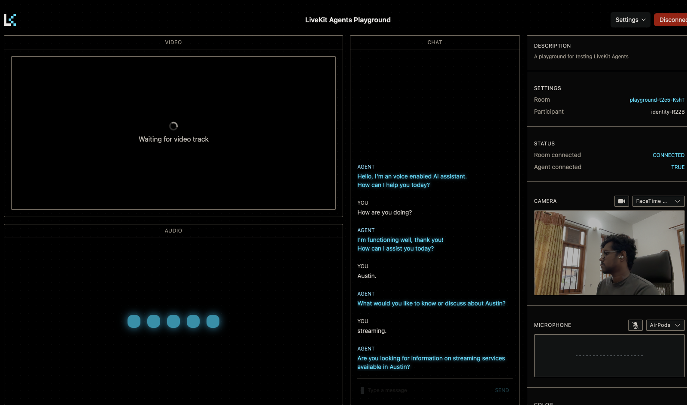

# open-assist
An open source ai voice assistant.



## Setup Guide

### Prerequisites

- [Livekitroom account](https://cloud.livekit.io)
- [Conda](https://docs.conda.io/projects/conda/en/latest/user-guide/install/index.html)
- Create a .env file in the root directory and add the variables mentioned in the .env.example file

### Clone the Repository

```sh
git clone https://github.com/yourusername/llm-scraper.git
cd llm-scraper
```

### Create a Conda Environment

```sh
conda env create -f environment.yml
conda activate llm-scraper
```

### Install dependencies via poetry

```sh
poetry install
```

### Run the Application

```sh
python3 main.py start
```

## Connect to livekitroom server using the livekit playground

```sh
https://agents-playground.livekit.io
```